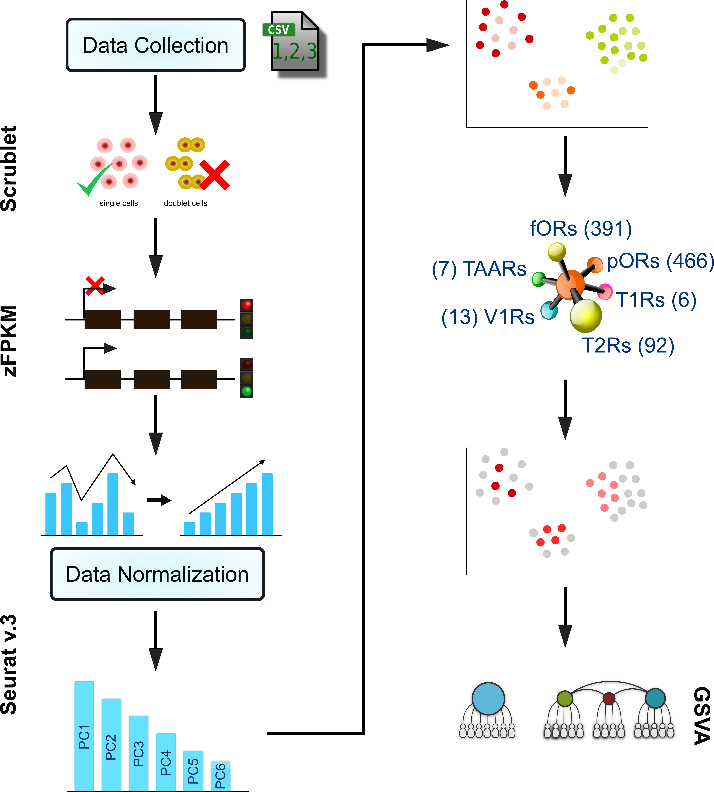

# Cancer-smell
## Workflow


**Load essential Libraries** <br/>
The initial step is to load all the necessary libraries

```r
#Loading Essential Libraries
library("reticulate") #To use one Python Library "Scrublet"
library("AnnotationDbi") #To convert one Id to Another
library("org.Hs.eg.db") #To use Genome wide annotation for Human
library(dplyr) #For Datasets Manipulation
library(tidyr) #For Datasets Manipulation
library(data.table) #For Datasets Manipulation
library(zFPKM) #To calulate zFPKM scores
library(Seurat) #For single cell analysis
library(ggplot2) #To plot graphs
library(RColorBrewer) #To define color-palette
library("GSVA") #To compute Gene Set Variation Analysis
library(GSEABase) #To compute Gene Set Variation Analysis
library(GSVAdata) #To compute Gene Set Variation Analysis
library(msigdb) #To load gmt file
```

Once all the libraries are properly loaded, we need to provide input files. This pipeline takes into account 6 sub famlies of GPCRs. The format of all these 6 Input Files is, a sinlge column csv file that contains **gene names** as entries and column heading as **"Symbol"**  <br/>

**Input Receptor files** <br/>
```r
f_or<-read.csv("Main_pipeline/Receptor_files/functional_or.csv",header=TRUE)
p_or<-read.csv("Main_pipeline/Receptor_files/pseudo_or.csv",header=TRUE)
t1r<-read.csv("Main_pipeline/Receptor_files/t1r.csv",header=TRUE)
t2r<-read.csv("Main_pipeline/Receptor_files/t2r.csv",header=TRUE)
taar<-read.csv("Main_pipeline/Receptor_files/taar.csv",header=TRUE)
v1r<-read.csv("Main_pipeline/Receptor_files/v1r.csv",header=TRUE)
```
